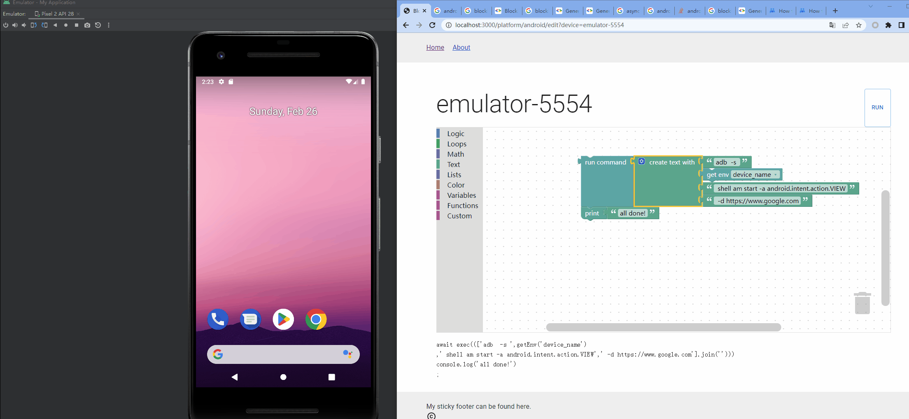

# blockly-auto-ui

ui automation with blockly

android with ADB will go first



## usage | 使用

dev(hot-reload for frontend only) | 开发(热加载仅限前端代码)

```
npm run dev
```

production | 产线

```
npm run build
npm run start
```
